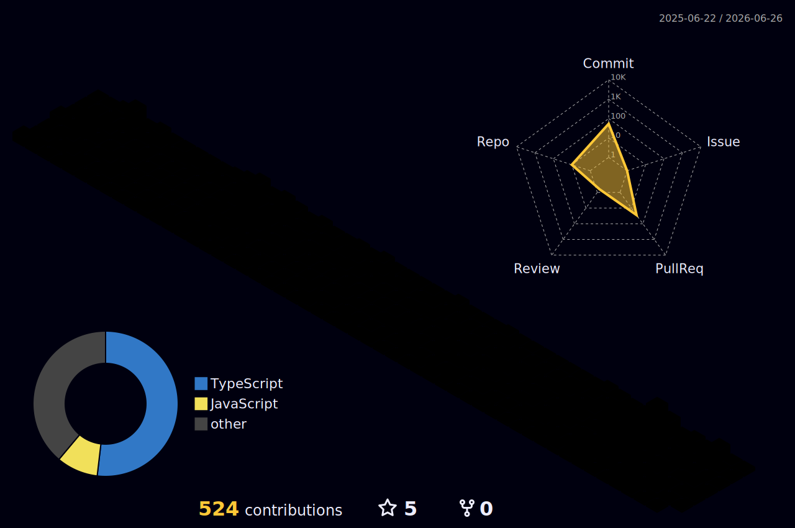

# Hi there, I'm Ahmad Riyo Kusuma

### 🌟 About Me :

- 🎓 Informatics Engineering Student at Universitas Islam Kalimantan
- 🖥️ Passionate Web Developer and Freelancer

### 🌱 Currently Learning :

- **Automation Systems** to build efficient workflows and integrate smart features into web applications
- **LLM & AI Engineering** to explore AI integration, prompt engineering, and intelligent system design
- **Modern JavaScript Ecosystem** deepening expertise in React, Next.js, NestJS, Astro, and Vue.js for scalable applications
- **TypeScript** to write safer, more maintainable, and scalable code across frontend and backend

##

### 🗣️ Languages :

  
  
  
  
  

### ⚙️ Frontend Frameworks & Libraries:

  
  
  
  
  
  
  

### 🚀 Backend Frameworks:

  
  
  
  
  

### 💾 Databases & Backend Services:

  
  
  
  
  

### 🛠 Dev & Productivity Tools :

  
  
  
  
  
  
  

## 🌍 My Passions :

- 🏋️‍♂️ Gym and staying healthy
- 👨‍🍳 Cooking and trying new recipes
- 💡 Exploring new tech and freelancing opportunities
- 📚 Exploring knowledge through reading books about **philosophy**

##

🎯 Fun Facts :

- I love creating engaging UI animations with **Framer Motion**
- I'm planning to expand my freelancing services internationally

### Github Statistic

## Contribution Activity

<picture>
  <source
    media="(prefers-color-scheme: dark)"
    srcset="https://raw.githubusercontent.com/ahmdriyo/ahmdriyo/output/github-snake-dark.svg"
  />

  <source
    media="(prefers-color-scheme: light)"
    srcset="https://raw.githubusercontent.com/ahmdriyo/ahmdriyo/output/github-snake.svg"
  />

</picture>

## 3D Contribution Graph

  

## 📬 Reach Me :

  
  

---

## 🌟 Random Inspiration :

_"Consistency beats talent when talent doesn’t work hard."_

---

> 🚀 Let's build something amazing together. Open to collaborations and freelance projects!
